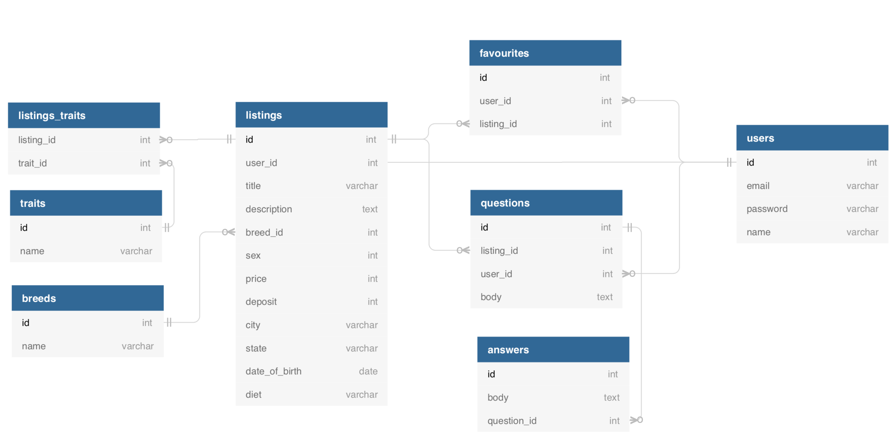

### Daily Lesson Breakdown

- Entity Relationship Diagram
- Enum
- Forms The Rails Way
- Byebug
- Validations

### Requirements

- Installed and setup dbeaver.io
- Need to put in the link to a GitHub repo here for the code we created yesterday

### Resources

- https://medium.com/@tinchorb/form-with-building-html-forms-in-rails-5-1-f30bd60ef52d
- https://edgeguides.rubyonrails.org/form_helpers.html
  - Use this guide on form helpers instead of the current stable Rails docs because the form_for and form_tag mentioned is slowly being deprecated for the form_with method mentioned in this newer guide.
- https://dbdiagram.io

### Lesson Material

For the next several lessons we will be building a Rails application that allows people to purchase and sell snakes. The wireframes that we will be working off of are here:

It is always important to start off any project with some wireframes because it allows you to build a mental model of exactly what needs to build and the data that will be required to be saved and updated to make it functional.

#### Entity Relationship Diagram

An Entity Relationship Diagram (ERD) is a way for us to map out our data model and show relationships between different tables. These come in very handy when building our applications because we can examine how our data is structured and the best way to normalise. It will also show us what associations we will need inside of Rails.

`Draw out an ERD with the class. Draw in lines to show relationships.`

Awesome so we are have a nice ERD but something is missing. Even though we have lines showing that there is a relationship between two attributes in a table those lines don’t describe the relationship.

There are different types of notation to help us describe these relationships in a an ERD. One of the more popular types of notations is called crows feet notation. This type of notation adds in symbols to the ends of the line. The different symbols and their meanings are below.

Let’s update our ERD to include crows feet notation so that it gives meaning to the associations.

This shows us the exact relationship between entities (tables). For example in this new diagram we know that a listing can have zero or many favourites and a favourite must have one and only one listing.

Now that we understand the data model a little better let’s get started with creating our snake application. For this lesson we will start with first building out a listing without a user. We will add in the user to a future lesson. Let’s get started.

    $ rails new snake_marketplace -d postgresql
    $ cd snake_marketplace
    $ rails generate model Breed name:string
    $ rails generate model Listing title:string description:text breed:references sex:integer price:integer deposit:integer city:string state:string date_of_birth:date diet:string
    $ rails db:create
    $ rails db:migrate
    $ rails server

Now that we have a new Rails project setup and up and running the first thing we should do is add to the seeds file for our snake breeds since the application doesn’t have anyway to populate this table and we always want the table to be full of data for us to use in a listing.

We will use a gem I have created specifically for this to populate the data.

    bundle add snake_names
    db/seeds.rb

    Snake.names.each do |name|
        Breed.create(name: name.downcase)
        puts "#{name} created"
    end

Now to run the seeds file.

    rails db:seed

Sweet now that we have the breeds data populated let’s finish off the association in our Rails model.

app/models/breed.rb

    class Breed < ApplicationRecord
        has_many :listings
    end

app/models/listing.rb

    class Listing < ApplicationRecord
        belongs_to :breed
        enum sex: { female: 0, male: 1 }
    end

Okay looking good but…..wait what is the enum thing all about?

#### Enum

Enumerated type is a data type consisting of a set of named values. It is really great for representing workflows or a small list of values. For example we could use an enum in a blogging application to state whether a post is a draft or published.

Enums are really good because the attribute value must be equal to one of the values that have been predefined for it. In our example we have two predefined values (female, male). That means our snakes sex cannot be anything other than these two values. The other thing you may have noticed about our enum is that we are using a hash to define these values. The key in the hash is what Rails uses however the value is what is actually stored in the database. The reason we are using an integer value is because integers are actually quicker to lookup in a database than a string.

Enums are really cool because they give us some extra methods in our ORM. Let’s play around with them to see what they give us.

    rails c
    rails console

    Listing.create(sex: "female", breed: Breed.first)

As you can see we can now use the key of the enum as a method. For the model we can call Listing.female to get an array of all the listings that have a sex of female.

rails console

    Listing.female
    Listing.male

On a particular record we can get the sex of the Listing using listing.sex or we can check to see if the sex is a certain key by calling listing.female?.

    rails console

    listing = Listing.first
    listing.sex
    listing.female?
    listing.male?

The last addition we get by using enums is easily changing it’s value. If we want to change the value of a listings sex from female to male we can use listing.male!

rails console

    listing.male!
    listing.sex

Ok let’s clear out our database for now and move on to setting up our routes, controller and views.

    rails db:setup

config/routes.rb

    Rails.application.routes.draw do
        get "/", to: "pages#home", as: "root"

        get "/listings", to: "listings#index", as: "listings"
        post "/listings", to: "listings#create"
        get "/listings/new", to: "listings#new", as: "new_listing"
        get "/listings/:id", to: "listings#show", as: "listing"
        put "/listings/:id", to: "listings#update"
        patch "/listings/:id", to: "listings#update"
        delete "/listings/:id", to: "listings#destroy"
        get "/listings/:id/edit", to: "listings#edit", as: "edit_listing"

        get "*path", to: "pages#not_found"
    end

app/controllers/pages_controller.rb

    class PagesController < ApplicationController
        def home
            render plain: "home page"
        end

        def not_found
            render plain: "not found"
        end
    end

app/controllers/listings_controller.rb

    class ListingsController < ApplicationController
        def index
            @listings = Listing.all
        end

        def show
            id = params[:id]
            @listing = Listing.find(id)
        end

        def new
        end

        def create
            #finish logic for creating a record
        end

        def edit
            id = params[:id]
            @listing = Listing.find(id)
        end

        def update
            id = params[:id]
            @listing = Listing.find(id)
            #finsih logic for updating the record
        end

        def destroy
            id = params[:id]
            @listing = Listing.find(id)
            #finish logic for deleting the record
        end
    end

views

    ├── app
        └── views
            ├── layouts
            ├── listings
                ├── index.html.erb
                ├── edit.html.erb
                ├── new.html.erb
                └── show.html.erb

Before we move on let’s cleanup our controller just a little bit. You can see that we have added in some code for our methods that needs to find a specific listing by the id given in params. But it doesn’t seem very dry because we have repeated the same two line of code 4 times. Let’s move this code into another method so that we don’t repeat ourselves.

app/controllers/listings_controller.rb

    def set_listing
        id = params[:id]
        @listing = Listing.find(id)
    end

Much better but now for us to use this method we would need to call it in every single method…..hmmm is there a better way? We can use a filter! Filters in Rails allow us to call a method at some point in the request lifecycle. We will use before_action to say that we want our set_listing method to run before certain other controller methods.

app/controllers/listings_controller.rb

    class ListingsController < ApplicationController
        before_action :set_listing, only: [:show, :edit, :update, :destroy]

        def index
            @listings = Listing.all
        end

        def show
        end

        def new
        end

        def create
            #finish logic for creating a record
        end

        def edit
        end

        def update
            #finsih logic for updating the record
        end

        def destroy
            #finish logic for deleting the record
        end

        private

        def set_listing
            id = params[:id]
            @listing = Listing.find(id)
        end
    end

Nice! We have cleaned up our code a lot. The private keyword in our class just means that any method declared underneath this keyword is only usable inside the class and not available directly to our object. Basically if we were to say:

rails console

    listing = ListingController.new
    listing.set_listing //would throw an error because it is set to private

Now that we have everything setup we can move on creating the forms for creating and editing our listing.

#### Forms The Rails Way

So we have in the past already created forms using pure HTML mixed with a little ERB and even though we got this working for us, this isn’t considered the “Rails way” of form creation. Rails comes with a lot of different methods that we can use in our views called view helpers. At the end of the day they helper methods just generate pure HTML for us so why can’t we use pure HTML and not use the helpers. Well you totally can and we have but let’s explore what extra goodies we get when we use the view helpers.

Now there are a couple of different ways to generate our < form > tag in Rails but now that we are using Rails 5.2 there is only one method that you should be using. The methods form_tag and form_for are deprecated and will not be supported in future versions of Rails. They have both been replaced by a single method named form_with. That is the method we will use to generate our < form > tag.

app/views/listings/new.html.erb

    <h1>New Listing</h1>

    <%= form_with do %>

    <% end %>

When we reload and inspect the < form > tag and the hidden < input > with the authenticity token has been created for us, which is awesome. One problem though is that the url is going to the wrong place. Now we could change it directly by passing in a named parameter to our form_with method but since we have been following Rails convention this whole time we can actually give it a new instance of the model we want to create.

   app/views/listings/new.html.erb

    <h1>New Listing</h1>

    <%= form_with model: Listing.new do %>

    <% end %>

It’s working! Our url action and method are both correct but we have just made our view semi smart by instantiating this object in the view. The better place to have done this is in the controller. Like this:

   app/controllers/listings_controller.rb

    def new
        @listing = Listing.new
    end

   app/views/listings/new.html.erb

    <h1>New Listing</h1>

    <%= form_with model: @listing do %>

    <% end %>

Sweet, we now have the controller instantiating the object and the view just using it; much better. Ok let’s start adding in the different fields to our form. We are going to be using view helper functions for each field. For now lets leave off breed and sex. We will talk about those next. It’s actually really easy to associate fields with our listing object. All we need to do is accept an argument into the block. We will name this form (you can name it whatever you want). Then we just use Rails normal view helper methods on this argument, passing in a symbol representation of the column we want this field to be for.

If you have trouble remembering the symbol representations for your different fields just go the migration you created the table with. All the field symbols are within there.

We are also going to add an additional named argument to our form_with method. This named argument is local, which we want to set to true since Rails defaults this value to false. Long story short is that there are two different ways to submit a form in the browser. We can either allow Javascript to submit the form or we can make the browser submit the form and reload the page. Since we haven’t covered Javascript yet we want our browser to do the submitting, which is why we set local to true.

Now to the code!

    <%= form_with(model: @listing, local: true) do |form| %>
        

            <%= form.text_field :title %>
        

        

            <%= form.label :description %>
            <%= form.text_area :description %>
        

        

            <%= form.label :price %>
            <%= form.number_field :price, min: 0 %>
        

        

            <%= form.label :deposit %>
            <%= form.number_field :deposit, min: 0 %>
        

        

            <%= form.label :city %>
            <%= form.text_field :city %>
        

        

            <%= form.label :state %>
            <%= form.text_field :state %>
        

        

            <%= form.label :date_of_birth %>
            <%= form.date_field :date_of_birth %>
        

        

            <%= form.label :diet %>
            <%= form.text_field :diet %>
        

        

            <%= form.submit %>
        

    <% end %>

Awesome! We have generated all of our HTML by using ruby methods!

Check out the code in the inspector and see all the goodies we were given by using the methods. The naming is correct, labels have had their for attributes filled out and fields have been given the corresponding id's. Even the submit button has been given the appropriate value.

This is pretty cool and saves us a lot of time. Next let’s handle the breed field. When we look at our wireframes this is going to be a select field filled out with options for all the different breeds.
