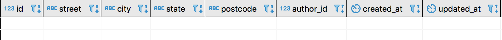

### Daily Lesson Breakdown

- Relational Databases
- One To One
- One To Many

### Requirements

- Installed and setup dbeaver.io

### Resources

- https://guides.rubyonrails.org/active_record_querying.html
- https://guides.rubyonrails.org/association_basics.html

### Lesson Material

#### Relational Databases

Currently we have explored how to save data into our tables. We were able to create, read, update and delete the different rows within this table. So now what if we want to create another table to store data about another resource. Easy right, we just need to create a new migration that creates this table, setup the model and away we go. Awesome! But what if information from our first table needs to relate to information in our second table?

Lets say that we have a table of authors. Our table might look like this:

| id  | name       | date_of_birth |
| --- | ---------- | ------------- |
| 1   | JK Rowling | 1965-07-31    |
|     |            |               |

Ok we have already done this so no big deal. Now we also want to keep the address information for all of our authors. We could just add this information as more columns in our current table but that might get kinda messy. Also whenever we get information about an author we may not need their address information. It would be nice if we could store all of our authors address information in a seperate tale and whenever we needed it we could retrieve it. Well this is possible in a relational database! This type of relation is call a one to one relationship.

An author will only have one address and an address will always belong to one author. So our address table may look like this:

| id  | author_id | street            | city   | state          | postcode |
| --- | --------- | ----------------- | ------ | -------------- | -------- |
| 1   | 1         | 50 Bedford Square | London | Greater London | WC       |

Now this looks pretty normal for a table to hold address except for one of the columns.

    What information might the author_id column hold?

The id of the author this address belongs to!

We call this column a foreign key. Basically a foreign key is a single column or a grouping of multiple columns in a database table that allows us to uniquely identify a row in another table. In this example our author_id column is the foreign key and identifies that it relates to the author table row of the same id.

Sticking with the authors example we would also probably want to save information on the books the author has written and we would want our books table to have information about the author. Our table could look something like this:

| id  | title        | genre   | author     |
| --- | ------------ | ------- | ---------- |
| 1   | Harry Potter | Fantasy | JK Rowling |

    Now this is kinda ok but what seems a little bit weird?

We have repeated the author name in two different tables. Now sometimes this is ok but in relational databases most of the time we want to normalize our data.

**Data normalization** just means that we want to structure the way we save our data in a way that reduces or eliminates the need to repeat ourselves.

**From what we learned earlier how could we normalize this data?**

A foreign key! We could have a column within our books table that refers to a column in our authors table! Something like this:

| id  | title        | genre   | author_id |
| --- | ------------ | ------- | --------- |
| 1   | Harry Potter | Fantasy | 1         |

This relation is known as a one to many relationship because every book only has one author but an author may have many books that they have written.

Ok now that we understand a little bit more about relational databases lets set these relationships up both in the database and in the Rails models.

#### One To One

So the first thing we need to do is create a new Rails app that holds a bunch of authors. We won’t be setting up any views in this lesson. We are going to be using the rails console and checking our results in the console and dbeaver.

    rails new associations_lesson -d postgresql
    cd associations_lesson
    rails generate model Author name:string date_of_birth:date
    rails db:create
    rails db:migrate
    rails console

Nice! Now we can create, read, update and delete records in our authors table. The model generator sets up both our model and our migration for us!

    Review some of the CRUD methods on our Author model.

Ok so we have our authors table and everything is working just fine.

    What do you think the first thing we need to do is, to setup our one to one relationship with authors and their addresses?

Create the addresses table!

    So lets do that.

    rails generate model Address street:string city:string state:string postcode:string author:references

Before we run the migration let’s take a look at it.

    class CreateAddresses < ActiveRecord::Migration[5.2]
        def change
            create_table :addresses do |t|
                t.string :street
                t.string :city
                t.string :state
                t.string :postcode
                t.references :author, foreign_key: true
                t.timestamps
            end
        end
    end

There is now this references thing that is about to be created. Basically this is Rails way of saying hey we need a columns that references the author table and yes this will be a foreign key. Now run the migration and see what we get.

    rails db:migrate

In dbeaver our table looks like this:

Perfect! Exactly what we wanted. Really this is all we have to do from a database point of view if I can create a new author and an address with that authors id.

    In Rails console

Note: If you already had your Rails console running you may need to run the reload command so that the new model is loaded.

    reload!
    Author.create(name: "JK Rowling", date_of_birth: "1965-07-31")
    Address.create(street: "50 Bedford Square", city: "London", state: "Greater London", postcode: "WC", author_id: 1)

Awesome we could create the new rows in our tables.

    What would happen if we try to create a address without a author id?

We can’t!

    What if we try to now delete this author?

We can’t! That’s because it would create what is called an orphaned record. These are records that have lost their relation to another table and it is never a good thing. We will fix this in a second, so that if an author is deleted all of it’s dependents are also deleted.

But before we are able to do that we need to setup an association in our model. In short our database now knows about the relationship between our two tables but our models do not. To fix that we need to setup an association.

There are many different types of associations we can setup in Rails for all the different kinds of relationships our tables can have to one another.

We will go through each of these but for reference here is a list of the associations:

- belongs_to
  - books belongs to an author
- has_one
  - author has one address
- has_many
  - author has many books
- has_many :through
  - doctor has many patients through appointments
- has_one :through
  - supplier has one account history through an account
- has_and_belongs_to_many
  - parts has many assemblies and belongs to many assemblies
  - basically this is a has many through relationship without access to the join table

So where do you think we will define this relationship?

In the model. Lets start with the Address model if we take a look……wait it’s already setup for us! Go Rails magic.

    app/model/address.rb

    class Address < ApplicationRecord
        belongs_to :author
    end

So our address belongs to an author but this is only half of the relationship. We still need to say that an author has one address.

    app/model/author.rb

    class Author < ApplicationRecord
        has_one :address
    end

This works because we have been following the Rails convention. Now there is a longer way to write this out that looks like this:

    has_one :object, class_name: "object", foreign_key: "object_id"

But we don’t need to use it since we haven’t gone against the convention. One thing we can add in is to tell Rails that if an author gets deleted we also want to delete their address.

    app/model/author.rb

    class Author < ApplicationRecord
        has_one :address, dependent: :destroy
    end

Now when we run this command in console both the author and address are deleted.

    rails console

    Author.find(1).destroy

Thats super cool! But we also get so much more now that the association is setup.

Let’s create another author and their associated address. In the past we had to first create the author and then the address by passing in the author_id but now we have the association setup we can do this a little differently.

    rails console

    author = Author.create(name: "JR Tolkien", date_of_birth: "1950-01-01")

    author.create_address(street: "123 Fake Street", city: "New York City", state: "New York", postcode: "1111")

Awesome! It associated the address straight to the author instead of having to know the author id. Now if we want to retrieve the address for the author we just need to call the association just like any other attribute.

    rails console

    Author.first.address

How awesome is this! Or we can get the author for an address.

    rails console

    Address.first.author

We can even update the author straight from an address.

rails console

    address = Address.first
    address.author.name = "J.R. Tolkien"
    address.author.save

#### One To Many

Ok so the has one has been taken care of, now to implement our one to many relationship of books to an author. First we need to create our books table.

    rails generate model Book title:string genre:string author:references
    rails db:migrate

Nice the only thing left to do is to declare the relationship in the models. We know that the Book model already has the belongs_to relationship defined because of Rails magic. We just have to define the other half of the relationship in our Author model.

    app/models/author.rb

    class Author < ApplicationRecord
        has_one :address, dependent: :destroy
        has_many :books, dependent: :destroy
    end

Notice we have used the plural books in this relationship instead of the singular. That is because it is has many and not has one. And that’s it!

    rails console

    author = Author.first

    author.books.create(title: "Lord of the rings", genre: "fantasy")

Take notice that we were able to create a record for this association slightly different than before. Instead of calling the method create\_{association}, we were able to just call the create methods directly on the books property.

When we call author.books we are getting back an array of records. Not a single record.

Another way to insert a record into a has_many is with the shovel operator.

    rails console

    author = Author.first
    book = Book.new
    book.title = "The Hobbit"
    book.genre = "fantasy"
    author.books << book

Sometime there is confusion about which model gets the has_one/has_many association and which one gets the belongs_to association. Whichever model has the foreign_key belongs_to wherever that foreign key references.
