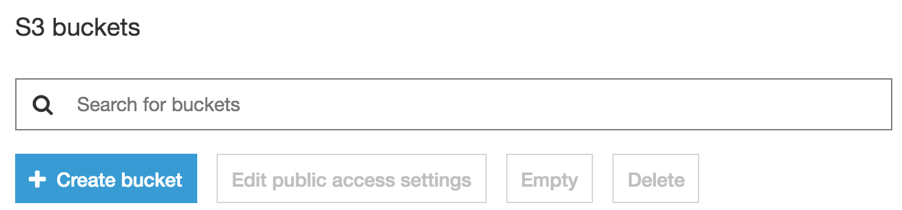
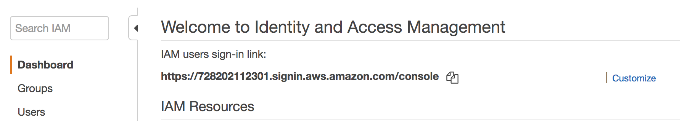
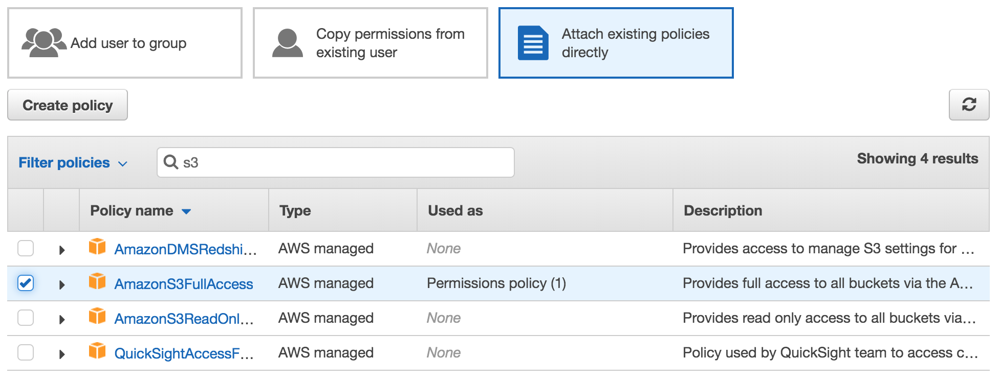

### Daily Lesson Breakdown
- Handling Images
- Image Uploading (Active Storage)
- Amazon S3

### Requirements
- Cloned copy of Day 10 code
- AWS account

### Resources

- https://guides.rubyonrails.org/active_storage_overview.html
- https://guides.rubyonrails.org/asset_pipeline.html
- https://evilmartians.com/chronicles/rails-5-2-active-storage-and-beyond

### Lesson Material
#### Handling Images

In our web applications we normally want to add in some imagery at some point or another. Images really allow our webpages to a rich experience for the user. Currently in our web app we have created a route to handle the homepage. Let’s add a little bit more content to the homepage to make it a more pleasant experience for our user. First thing we need to do is create the view for it.

**app/views/pages/home.html.erb**

	<h1>Legless Pets</h1>

	
Find your dream snake

	
Just remove the render method from the pages controller and refresh the page.

Our view is working! Got to love Rails magic. But this page feels a little lacking it would be better if we added an image to it as well to spice things up. One of the ways we have added imagery in the past is just by referencing the url where the image is hosted.

**app/views/pages/home.html.erb**

	<h1>Legless Pets</h1>
	
	<%= image_tag "https://bit.ly/2IvqozP", alt: "Pretty snakes" %>
	
	

	  Find your dream snake
	

	
We are using a Rails helper method to generate the appropriate HTML here but why is bad to use an image from a an outside URL (a url we don't control)?

- Urls can expire or be moved
- No control over the quality and size of the image
- No control over the speed at which that image can be loaded (at the mercy of the 3rd party server)

Ok so if all this is bad whats the better option?

Host the images ourselves! In Rails we can store imagery that our web application is going to use directory in the web application. Rails has what is known as an asset pipeline, which is basically a fancy term for a convention of where you should store your imagery and what methods should be used to use them.

In Rails we store all of our images in the app/assets/images directory.

Download the image from the example, rename it hero.png and store it within this directory.

Ok so our image in now located in this directory, now what? Well we use the exact same view helper method but just give it the name of the image. Like this:

**app/views/pages/home.html.erb**

	<%= image_tag "hero.png", alt: "Boy with legs tangled" %>
	
Rails automatically looks inside our images directory within assets to see if an image of that name exists before looking in other locations. It’s that easy! But what if we want to use the image as a background image in our CSS instead of using the  HTML tag? First we will modify our view so that it will have a 
 that will get our background image:

**app/views/pages/home.html.erb**

	<h1>Legless Pets</h1>
	
	

	
	

	  Find your dream snake
	

	
And then let’s create some CSS to make sure our stylesheets are working.

**app/assets/stylesheets/pages_home.scss**
	
	.hero {
	  width: 200px;
	  height: 200px;
	  background-color: red;
	}
	
Refresh the page and it looks like everything is hooked up. Now to get our scss using our image. There are a couple of different ways to do this. If we wanted to use erb in our scss file we would just need to add the .erb extension and away we go! However when we use the .erb extension we loose syntax highlighting and autocomplete for our styling rules which is just annoying, so Rails gives us another way. It extended scss for us and added in a couple new method we can use. One of those is image-path.

**app/views/pages/home.html.erb**

	.hero {
	  width: 200px;
	  height: 200px;
	  background-image: url(image-path("hero.png"));
	  background-size: cover;
	}
	
It’s as easy as that!

#### Image Uploading (Active Storage)

So now we know how to handle static images (images that won’t change) on our site but what about dynamic images (images that our users will upload). Rails has a built in system for storing dynamic changes, this is called ActiveStorage. ActiveStorage come preloaded with Rails but it isn’t activated right out of the box. To do this we need to run a command in Rails that is going to setup ActiveStorage and create a new migration for us to run.

	rails active_storage:install
	rails db:migrate
	
There is a configuration file that controls where ActiveStorage saves our images. This file is located at **config/storage.yml**. The other files used to configure our app are located in config/environments. The setting we are most interested in is **config.active_storage.service**. This setting tells Rails which of the configurations in our storage.yml file to use. For now let’s leave the default settings and see what happens.

Ok now that we have ActiveStorage all setup let’s add a way to add images to our listing in our Rails app. The first thing we need to do is allow someone to upload a file in our form.

	

	  <%= form.label :picture %> <%= form.file_field :picture, accept:
	  'image/png,image/gif,image/jpeg,image/jpg' %>
	

	
Ok now we have this image in our form we need to adjust our controller to allow this new parameter through.

**app/controllers/listings_controller.rb**

	def listing_params
	    params.require(:listing).permit(:title, :description, :breed_id, :sex, :price, :deposit, :city, :state, :date_of_birth, :diet, :picture)
	end
	
Now when we try to save our new listing……we get an error. That’s because we haven’t told the model what to do with this new attribute.

ActiveStorage makes it really easy for us. If we only want a single file attached to record we use has_one_attached and if a record can have multiple files we will use has_many_attached. Really that’s it! We only want a single image attached to our listing for now so let’s set this up on the Listing model.

**app/models/listing.rb**

	class Listing < ApplicationRecord
	    belongs_to :breed
	    enum sex: { female: 0, male: 1 }
	    validates :title, :breed_id, :sex, :price, :deposit, :city, :state, :date_of_birth, presence: true
	    has_one_attached :picture
	end
	
Now when we fill out the form and save the image…..it works! Well….we didn’t get an error so that’s good. But where did the image go? According to our configuration setup for development it was saved in the storage directory. If we look in that directory there is new file which is holding our image but it’s in binary so we can’t really preview it.

But we can modify our view to use the saved image.

	<h1>Snake Listings</h1>
	
	<% for listing in @listings %>
	

	  <%= image_tag listing.picture if listing.picture.attached? %>
	  
<%= listing.title %>

	  
<%= "#{listing.city}, #{listing.state}" %>

	  
<%= listing.date_of_birth %>

	  
<%= listing.price %>

	  <%= link_to "edit", edit_listing_path(listing.id) %>
	

	<% end %>
	
How easy is that! If we take a look in our .gitignore file however we see that the storage directory has been ignored.

Why isn't it good to keep all of our user uploaded imagery in our web application?

It could get massive! Plus adding all those files to git doesn’t really make sense either.

So what would be a better solution?

Store all of our images in a different location besides our web app and reference those images via a url.

We could make our own storage solution for our images but there are already plenty of these available to us and at no cost. So it doesn’t make sense to leverage these services.

#### Amazon S3

AWS (Amazon Web Services) has a solution we can use called S3. S3 is for data storage that you can access via a url, which is perfect for what we need.

1. You will need to register and sign in to AWS
2. Go to S3 and create a new bucket

	

3. Enter a unique bucket name and make sure your region is set to Asia Pacific (Sydney)
4. Click next through the rest
5. We need to setup a new user that will have access to this bucket. To do this go to the IAM service in AWS.

	
	
6. From here click Users -> Add User, and enter a username and unique bucket name.

	
	
7. Click next -> attach existing policies -> check AmazonS3FullAccess

	

8. Click next until you get to the review.
9. Copy down your access id and secret.

Now that we have S3 all setup and good to go we need to get Rails ActiveStorage setup to use S3. First things first let’s add our keys into the encrypted credentials files by running this rails command:

	EDITOR="code --wait" rails credentials:edit

When it opens up the file add in our keys, save and close.

	aws:
	  access_key_id: {your_access_key}
	  secret_access_key: {your_secret_key}
	  
Once that is done we need to add a gem to our Rails app that adds in the ability to connect to S3.

	bundle add aws-sdk-s3

Next is to configure our Rails app with the new storage mechanism.

**config/storage.yml**

	amazon:
	  service: S3
	  access_key_id: <%= Rails.application.credentials.dig(:aws, :access_key_id) %>
	  secret_access_key: <%= Rails.application.credentials.dig(:aws, :secret_access_key) %>
	  region: ap-southeast-2
	  bucket: {your_unique_bucket_name}
	  
The region could possibly be different if you didn't choose Asia Pacific (Sydney) for your buckets region.

Last but not least to configure our environment to use this new storage configuration.

**config/environments/development.rb & config/environments/production.rb**

	config.active_storage.service = :amazon

Dang that was a lot of steps but now we are all setup!

Try creating a new listing with an image and see what happens. If you refresh the S3 bucket you will see the image is now appearing there instead of within your applications directory.
	

